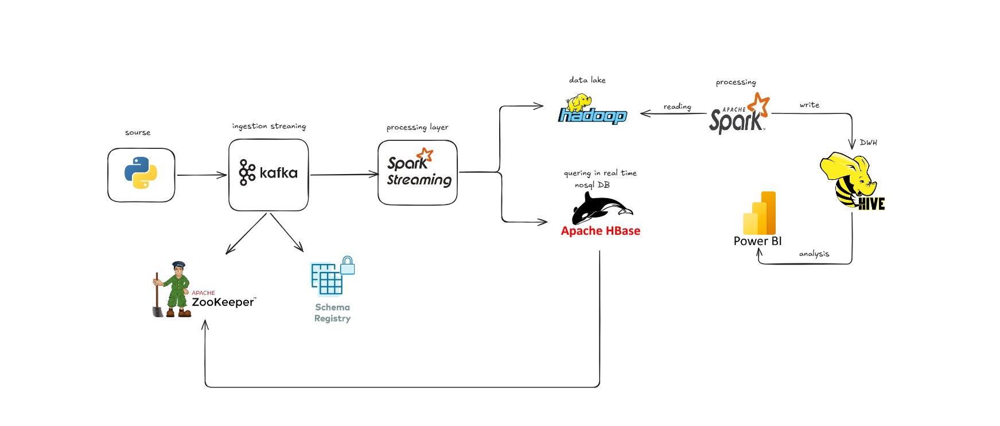
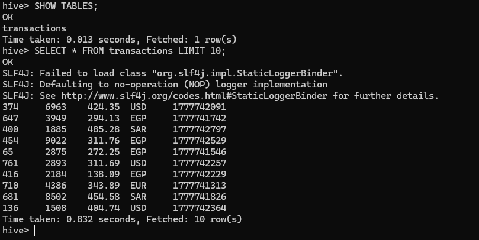
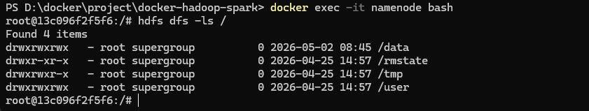
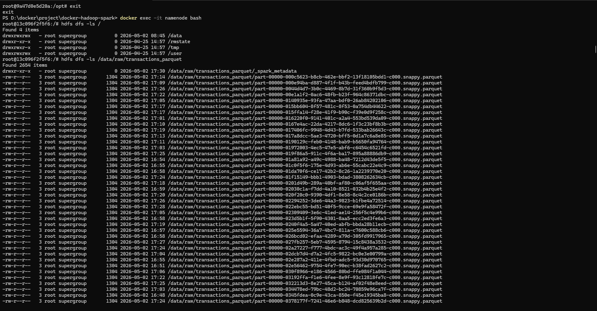
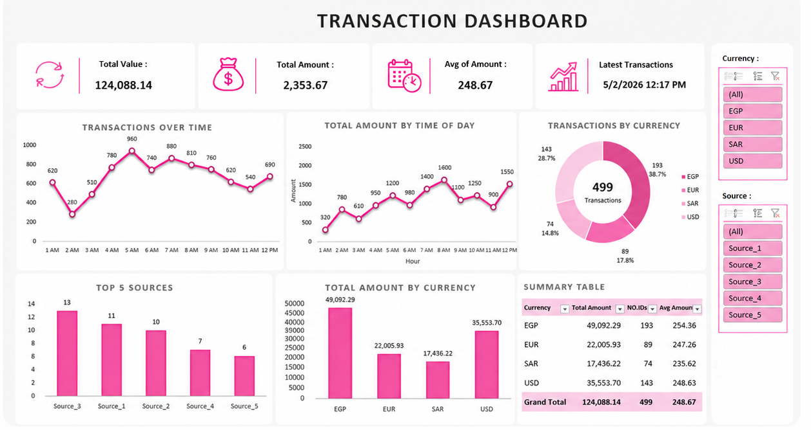

#  Real-Time Data Engineering Pipeline

##  Overview

An end-to-end real-time data engineering pipeline built using Apache Kafka, Spark Structured Streaming, Hadoop HDFS, Hive, HBase, Docker, and Power BI.

The project simulates streaming transaction data, processes it in real time using Spark Streaming, stores it in HDFS as Parquet files, and enables analytics and visualization through Hive and Power BI dashboards.

---

#  System Architecture

The following architecture demonstrates the complete real-time data engineering workflow from ingestion to analytics.



---

##  Architecture Flow

```text
Python Producer
      ↓
Apache Kafka
      ↓
Spark Structured Streaming
      ↓
HDFS Distributed Storage
      ↓
Hive Analytics Layer
      ↓
Power BI Dashboard
```

---

##  Components Description

| Component | Description |
|---|---|
| Python Producer | Generates real-time transaction data |
| Apache Kafka | Handles streaming ingestion |
| Spark Structured Streaming | Processes streaming events |
| Hadoop HDFS | Stores parquet files |
| Apache Hive | Enables SQL analytics |
| Apache HBase | Supports real-time querying |
| Power BI | Dashboard visualization |
| Zookeeper | Kafka coordination |
| Schema Registry | Schema management |

---

#  Technologies Used

- Python
- Apache Kafka
- Apache Spark Structured Streaming
- Hadoop HDFS
- Apache Hive
- Apache HBase
- Docker
- Power BI
- Parquet

---

#  Project Structure

```bash
real-time-data-engineering-pipeline/
│
├── producer/
│   └── producer.py
│
├── streaming/
│   └── spark_streaming.py
│
├── transformation/
│   └── transform.py
│
├── screenshots/
│   ├── architecture.png
│   ├── dashboard.png
│   ├── hive_query.png
│   ├── hdfs_root.png
│   └── parquet_files.png
│
├── docker-compose.yml
├── requirements.txt
├── README.md
└── .gitignore
```

---

#  Docker Setup

## Start Containers

```bash
docker-compose up -d
```

## Check Running Containers

```bash
docker ps
```

## Stop Containers

```bash
docker-compose down
```

---

#  Kafka Setup

## Enter Kafka Container

```bash
docker exec -it broker bash
```

## Create Kafka Topic

```bash
kafka-topics --create \
--topic transaction \
--bootstrap-server localhost:9092
```

## List Kafka Topics

```bash
kafka-topics --list \
--bootstrap-server localhost:9092
```

---

#  Run Kafka Producer

## Start Producer

```bash
python producer.py
```

The producer continuously generates random transaction data and streams it into Kafka.

---

#  Spark Structured Streaming

## Run Spark Streaming Job

```bash
spark-submit spark_streaming.py
```

Spark continuously consumes Kafka data and writes parquet files into HDFS.

---

#  HDFS Commands

## Enter Namenode Container

```bash
docker exec -it namenode bash
```

## View HDFS Root

```bash
hdfs dfs -ls /
```

## View Stored Parquet Files

```bash
hdfs dfs -ls /data/raw/transactions_parquet
```

---

#  Hive Setup

## Open Hive Shell

```bash
docker exec -it hive-server bash
beeline -u jdbc:hive2://localhost:10000
```

---

#  Create Hive External Table

```sql
CREATE EXTERNAL TABLE transactions (
    id INT,
    value INT,
    amount DOUBLE,
    currency STRING,
    timestamp BIGINT
)
STORED AS PARQUET
LOCATION '/data/raw/transactions_parquet';
```

---

#  Hive Queries

## Show Tables

```sql
SHOW TABLES;
```

## View Sample Data

```sql
SELECT * FROM transactions LIMIT 10;
```

## Currency Analysis

```sql
SELECT currency, COUNT(*) AS total_transactions
FROM transactions
GROUP BY currency;
```

---

#  Power BI Dashboard

## Dashboard Overview

Real-time transaction analytics dashboard built to monitor streaming data, key metrics, and currency-based insights.

---

#  Screenshots

##  Architecture


---

##  Hive Query Results



---

##  HDFS Root Directories



---

##  Parquet Files Stored in HDFS



---

##  Final Dashboard



---

#  Features

- Real-time streaming pipeline
- Distributed data storage
- Spark stream processing
- Kafka event streaming
- Parquet-based optimized storage
- Hive SQL analytics
- Dockerized big data environment
- Interactive Power BI dashboard

---

#  Data Engineering Concepts Applied

- Real-Time Data Streaming
- Distributed Systems
- Data Lake Architecture
- ETL Pipelines
- Stream Processing
- Big Data Analytics
- Distributed Storage
- SQL Analytics

---

#  Sample Output

| id | value | amount | currency | timestamp |
|---|---|---|---|---|
| 374 | 6963 | 424.35 | USD | 1777742091 |
| 647 | 3949 | 294.13 | EGP | 1777741742 |
| 400 | 1885 | 485.28 | SAR | 1777742797 |

---

#  Future Improvements

- Add Apache Airflow orchestration
- Implement Delta Lake
- Add monitoring with Grafana
- Deploy on Kubernetes
- Cloud deployment on Azure/AWS
- Implement CI/CD pipelines
- Add data quality validation

---

#  Author

## Eman abdelnaby & Sara El-Damarany 

Aspiring Data Engineer passionate about building scalable real-time data platforms and distributed analytics systems.

---

#  GitHub Topics

```text
data-engineering
kafka
spark
spark-streaming
hadoop
hdfs
hive
docker
etl
big-data
streaming
powerbi
```

---
